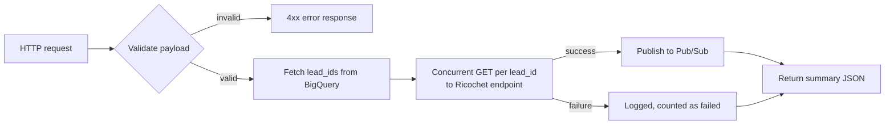

# Ricochet Lead Status History Extract

### Ricochet Apiary Documentation
https://ricochet.docs.apiary.io/#reference/leads/leads-collection/create-a-lead?console=1

A Google Cloud Function (HTTP, `functions-framework`) that pulls lead-level data from a [Ricochet360](https://www.ricochet360.com/) CRM instance and publishes it to a Pub/Sub topic for downstream ingestion into BigQuery.

## What it does

1. Determines which `lead_id`s to process, in one of three modes:
   - **Default** — leads called "yesterday" (America/New_York), sourced from a BigQuery download-extracts table.
   - **Backfill** (`is_back_fill: "yes"`) — all distinct `lead_id`s from a table you specify.
   - **Custom leads** (`custom_leads: true`) — leads filtered by an arbitrary column/value list you specify.
2. For each `lead_id`, calls the requested Ricochet REST `endpoint` concurrently (thread pool, sliding-window rate limited).
3. Publishes each successful response as a JSON message to a Pub/Sub topic, tagged with a `report_name` your downstream BigQuery pipeline uses to route it to the right table.
4. Returns a JSON summary (`total_leads`, `successful`, `failed`, `messages_published`).



## Required environment variables

| Variable | Required | Description |
|---|---|---|
| `PROJECT_ID` | Yes | GCP project used for both BigQuery and Pub/Sub. |
| `PUBSUB_TOPIC` | Yes | Pub/Sub topic ID that successful results are published to. |
| `SERVICE_ACCOUNT_INFO` | No | JSON string of a service account key. If unset, falls back to Application Default Credentials (recommended when running on GCP). |
| `BIGQUERY_DATASET` | No | Dataset containing the download-extracts tables used by the default (non-backfill, non-custom) lead query. Defaults to `python_extracts`. |

## Request payload reference

Send a JSON body (`Content-Type: application/json`) with:

| Field | Type | Required | Notes |
|---|---|---|---|
| `agency` | string | Yes | e.g. `"KA"` or `"MA"`. Only affects which default download-extracts table is queried. |
| `ricochet_host_name` | string | Yes | Base URL of the Ricochet instance to call, e.g. `https://yourcompany.ricochet360.com/api/v1`. |
| `ricochet_user_id` | string | Yes | Sent as the `X-Auth-Token` header on every Ricochet request. |
| `endpoint` | string | Yes | One of the keys in the endpoint table below. |
| `is_back_fill` | string | No | `"yes"` to enable backfill mode. Defaults to `"no"`. |
| `back_fill_leads_table` | string | If backfill | Fully-qualified BigQuery table (`project.dataset.table`) to pull distinct `lead_id`s from. |
| `custom_leads` | bool | No | `true` to enable custom-filtered lead mode. Mutually exclusive with `is_back_fill`. |
| `custom_table` | string | If custom_leads | Fully-qualified BigQuery table to filter. |
| `filter_field` | string | If custom_leads | Column name to filter on. |
| `filter_value` | list | If custom_leads | List of values to match via `IN UNNEST(...)`. |

`back_fill_leads_table`, `custom_table`, and `filter_field` are validated against an identifier allow-list before being used in a query, but **you are responsible for only pointing them at tables you trust**, since BigQuery doesn't support parameterized identifiers.

### Valid `endpoint` values

| `endpoint` | Pub/Sub `report_name` |
|---|---|
| `status-history` | `tb_rico_status_leads` |
| `call-history` | `tb_rico_status_calls` |
| `ma-status-history` | `tb_ma_rico_status_leads` |
| `ma-call-history` | `tb_ma_rico_status_calls` |
| `notes` | `tb_rico_notes` |
| `ma-notes` | `tb_ma_rico_notes` |
| `tasks` | `tb_rico_tasks` |
| `ma-tasks` | `tb_ma_rico_tasks` |
| `leads` | `tb_rico_leads` |
| `ma-leads` | `tb_ma_rico_leads` |

## Deployment

```bash
gcloud functions deploy ricochet-lead-status-history-extract \
  --gen2 \
  --runtime=python312 \
  --region=YOUR_REGION \
  --source=. \
  --entry-point=main_handler \
  --trigger-http \
  --no-allow-unauthenticated \
  --set-env-vars="PROJECT_ID=your-gcp-project,PUBSUB_TOPIC=your-topic-id"
```

`--no-allow-unauthenticated` is strongly recommended — this function accepts a Ricochet host and auth token in the request body with no built-in authentication of its own, so invocation should be restricted via IAM (Cloud Scheduler service account, specific invoker identities, etc.).

## Usage via Postman

1. Set the request method to `POST` and the URL to your deployed function's trigger URL.
2. Under **Authorization**, choose **Bearer Token** and paste a Google-signed identity token for an account/service account with the `roles/cloudfunctions.invoker` role:
   ```bash
   gcloud auth print-identity-token
   ```
3. Under **Headers**, set `Content-Type: application/json`.
4. Under **Body → raw → JSON**, send a payload, e.g.:
   ```json
   {
     "agency": "KA",
     "ricochet_host_name": "https://yourcompany.ricochet360.com/api/v1",
     "ricochet_user_id": "YOUR_RICOCHET_AUTH_TOKEN",
     "endpoint": "status-history"
   }
   ```
5. Send. A `200` response returns the run summary; `4xx`/`5xx` responses return an `error` field describing what was missing or invalid.

## Usage via Cloud Scheduler

Create a scheduled job that invokes the function with a fixed payload and an OIDC token for authentication:

```bash
gcloud scheduler jobs create http ricochet-status-history-daily \
  --location=YOUR_REGION \
  --schedule="0 6 * * *" \
  --time-zone="America/New_York" \
  --uri="https://YOUR_REGION-YOUR_PROJECT.cloudfunctions.net/ricochet-lead-status-history-extract" \
  --http-method=POST \
  --oidc-service-account-email="scheduler-invoker@YOUR_PROJECT.iam.gserviceaccount.com" \
  --headers="Content-Type=application/json" \
  --message-body='{
    "agency": "KA",
    "ricochet_host_name": "https://yourcompany.ricochet360.com/api/v1",
    "ricochet_user_id": "YOUR_RICOCHET_AUTH_TOKEN",
    "endpoint": "status-history"
  }'
```

The `scheduler-invoker` service account must have the `roles/cloudfunctions.invoker` (or `roles/run.invoker` for Gen2) role on the function.

For backfills or custom-filtered runs, create separate one-off or ad-hoc Scheduler jobs (or trigger manually via Postman/`curl`) with `is_back_fill`/`custom_leads` set, rather than baking them into a recurring schedule.

## Local testing

```bash
pip install -r requirements.txt
functions-framework --target=main_handler --debug
```

Then run the unit tests:
```bash
python -m unittest test_main.py
```
